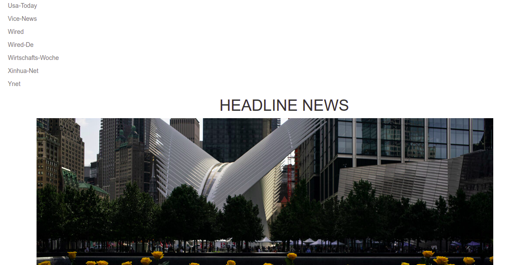
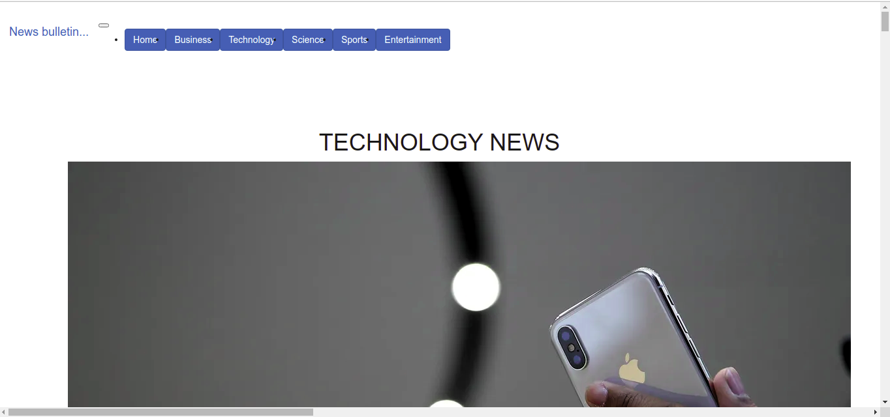
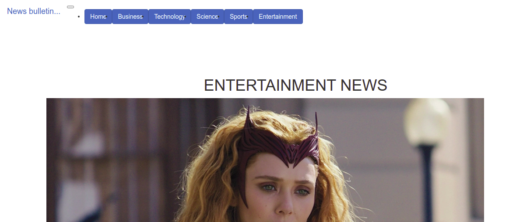

# News Ap

## Author

 Kolem Edwin

 ## Description
This is a flask application that lists and previews news articles from various sources using the NEWS API.

## Screenshot image




## Live page
https://github.com/edwinkipchumba/news-app


## Use stories
1. As a user, I would like to see various news sources on the homepage of the application.
2. As a user, I would also want to select a news source and see all news articles from the selected news source in the application.
3. As a user, I would want to see the image, description and the time a news article was created.
4. As a user, I would want to click on an article and read the full article on the source website.

## Behaviuor Driven Development (BDD)
| Behaviour | Input |Output |
| :----------------| :-------------------:| :------------------|
| Display news sources| On page load | List of various news sources displayed |
| Display tabs with news by category | On tab link click | Clickable links to open news based on category |
| Display artcles from a news source | Click a news | Redirected to a page with articles from the source | 
| Display the preview of an article | On page load | Each article displays an image,description and publication date|
| To read an entire article | Click on article | Redirected to the news source site |

## Installation/Setup instruction

#### The application requires the following installations to operate
* python3.8
* flask
* virtual
 
 #### Cloning

* Open Terminal {Ctrl+Alt+T}

```
$git clone https://github.com/edwinkipchumba/news-app
```
```
$cd news-app
```
* open based on the text editor you have.
  
```
$ source virtual/bin/activate
```
```
(virtual)$ pip install -r requirements.txt 
```
* To run the application, in your terminal:

```
$ chmod +x start.sh
```
```
$ ./start.sh
```

## Technology used

* flask
* HTML5
* Bootsrap4

## Known Bugs

If you find a bug, kindly feel free to comment an issue here and inlcude their corresponding results.

## Contact  Information

 Feel free to contact me incase of any issue or questions, ideas and concern towards the same.
 Contact Number:+254728357619
 E-Mail: edwinkolem5@gmail.com.

## License
[MIT License](https://choosealicense.com/licenses/mit/) ©2021,Kolem Edwin